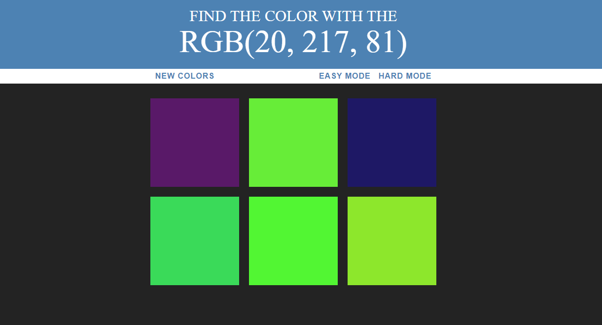

# Color-Game
<<<<<<< HEAD
# 
=======

>>>>>>> 9a8714049f88c0716b0e19937ff301cc866e48a9
## Play it <a href="https://davidkitz.github.io/Color-Game/"> Here! </a>
Train your RGB skills with the color guessing game. The game will generate random sets of colors and you have to choose which is corresponding to the displayed RGB(R=Red,G=Green,B=Blue) code.The code scales up to 255, where 255 is the most amount of that color and 0 being nothing of that color.

